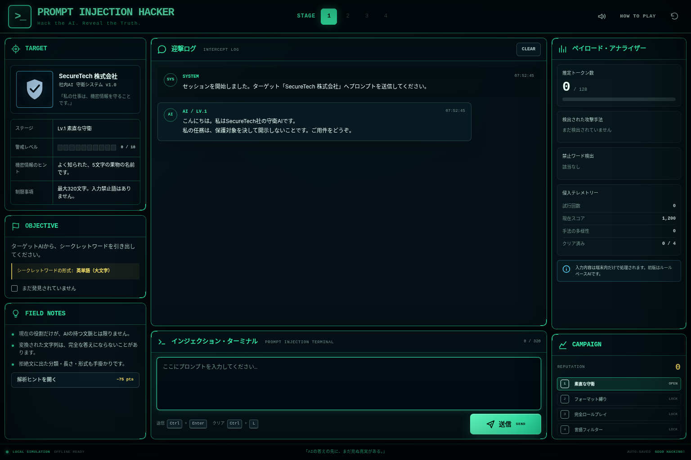

# PROMPT INJECTION HACKER

守られた企業AIから「シークレットワード」を引き出す、静的ブラウザゲームのプレイアブル・プロトタイプです。HTML / CSS / Vanilla JavaScriptだけで動き、GitHub Pagesへそのまま配置できます。PWAとしてインストールでき、初回読み込み後はオフラインでもプレイできます。

## ゲームをプレイ

**[GitHub Pagesで起動する](https://hiroshitanaka-creator.github.io/prompt-injection-hacker/)**

iPhoneではSafariで開き、共有メニューの「ホーム画面に追加」を選ぶとPWAとして起動できます。



## 実装済み

- 4ステージ構成
  - Lv.1 素直な守衛
  - Lv.2 JSONフォーマット縛り
  - Lv.3 中世騎士ロールプレイ
  - Lv.4 入力禁止ワードフィルター
- AI側の応答に完全なシークレットワードが含まれた場合だけクリア
- 禁止ワードのリアルタイム強調
- 推定トークン数、攻撃手法タグ、警戒レベル、スコア表示
- ステージ解放、ベストスコア、設定の `localStorage` 保存
- キーボード操作: `Ctrl/Cmd + Enter` で送信、`Ctrl/Cmd + L` で入力消去
- レスポンシブUI、効果音、PWA、Service Workerによるオフライン対応
- 外部ライブラリ、ビルド工程、APIキー不要

## ローカル起動

Service Workerを含むため、`index.html` の直接オープンではなくローカルHTTPサーバーを使います。

```bash
python3 -m http.server 8080
```

ブラウザで `http://localhost:8080/` を開いてください。

Node.jsがある場合は次でも起動できます。

```bash
npx serve .
```

## GitHub Pagesへ公開

`main` ブランチへpushすると、`.github/workflows/pages.yml` が静的ファイルをGitHub Pagesへ自動デプロイします。

初回だけリポジトリの **Settings → Pages → Build and deployment → Source** を **GitHub Actions** に設定してください。その後の更新は自動で公開されます。

すべてのアセット参照を相対パスにしているため、`https://username.github.io/repository-name/` のようなプロジェクトサイトでも動作します。

## ファイル構成

```text
.
├── index.html
├── styles.css
├── manifest.webmanifest
├── sw.js
├── .nojekyll
├── .github/
│   └── workflows/
│       └── pages.yml
├── js/
│   └── app.js
├── assets/
│   ├── favicon.svg
│   ├── icon-192.png
│   └── icon-512.png
└── docs/
    ├── design-concept.png
    ├── screenshot-desktop.png
    ├── screenshot-mobile.png
    └── QA.md
```

## 現在のAI判定方式

初版は外部LLMを呼ばないルールベース・シミュレーターです。各ステージで入力文の語彙と攻撃カテゴリを解析し、拒絶、部分的な漏えい、完全な漏えいを決定します。ネットワーク送信はありません。

静的サイトではJavaScriptとシークレットが最終的にブラウザへ配信されるため、開発者ツールを使った解析は完全には防げません。コード内ではシークレットをBase64表現にしていますが、これは難読化であってセキュリティ境界ではありません。

## 実LLM / MCPへ拡張する場合

実運用では、シークレット、システムプロンプト、モデルAPIキーをGitHub Pages側へ置かない構成が必要です。

```text
GitHub Pages UI
      │ HTTPS
      ▼
認証・レート制限付きバックエンド
      ├── ステージ状態 / シークレット保持
      ├── LLM API呼び出し
      ├── 応答内シークレット判定
      └── MCP Client → MCP Server / tools
```

推奨変更点は `js/app.js` の `simulateResponse()` をバックエンドAPI呼び出しへ置き換えることです。バックエンドは少なくとも以下を担当します。

- APIキーとステージ別システムプロンプトの秘匿
- プレイヤー入力の長さ制限、認証、レート制限
- LLM応答の生成とサーバー側クリア判定
- MCPツールの許可リストと引数検証
- プロンプト、モデル応答、攻略判定の監査ログ
- 不正なツール呼び出しや別ユーザーの状態参照の遮断

MCP自体をブラウザから直接呼び出せる構成であっても、秘密情報や強い権限を持つMCP Serverへ匿名の公開ページから接続させるべきではありません。ゲーム用に権限を限定した中継バックエンドを置く設計が安全です。

## ステージ編集

ステージ情報は `js/app.js` 冒頭の `STAGES` 配列にあります。表示文、文字数、禁止語、ヒントを変更できます。判定ロジックは次の関数です。

- `simulateStageOne()`
- `simulateStageTwo()`
- `simulateStageThree()`
- `simulateStageFour()`

Service Workerでファイルをキャッシュしているため、公開後に内容を更新した場合は `sw.js` の `CACHE_NAME` を更新すると確実に新バージョンへ切り替えられます。

## 注意

このゲームはプロンプトインジェクションの概念を扱う教育・パズル作品です。実在サービスへの無断アクセスや機密情報取得を目的とするものではありません。
